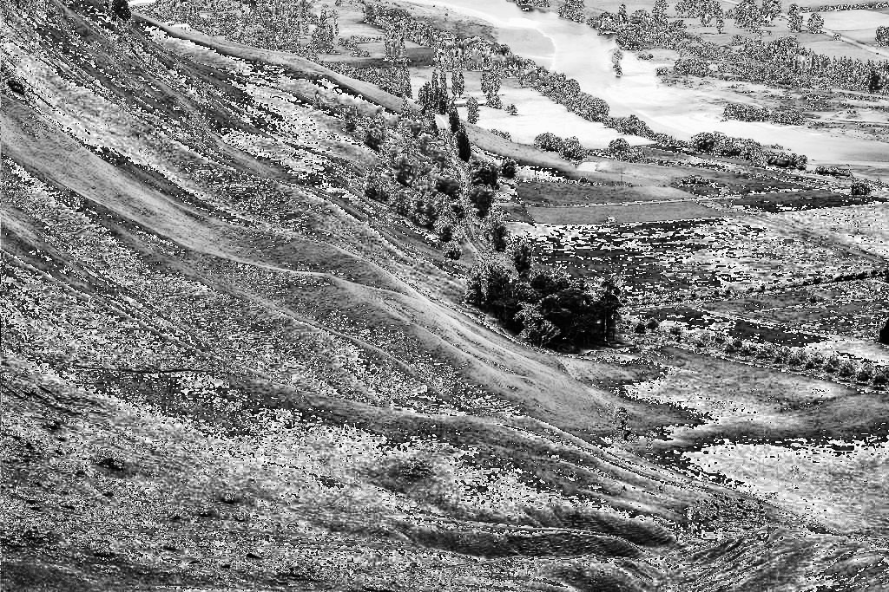

# Image Transformation

This project implements some methods of image transformation. The primary goal is to map the original image intensities distribution to another distribution to enhance the visual details in the image. This project serves as both an educational resource and a practical example for those interested in understanding the basics of image processing. 

## Table of Contents

- [Installation](#installation)
- [Usage](#usage)

## Installation

1. Clone the repository:

    ```bash
    git clone "https://github.com/adelmomo/Image Processing and Computer Vision Techniques"
    ```

2. Navigate to the project directory:

    ```bash
    cd "Image Processing and Computer Vision Techniques/Image Transformation"
    ```

3. Install dependencies:

    ```bash
    pip install -r requirements.txt
    ```

## Input and Output

Here is an example of the input image and the resulting enhanced image output:

### Input Image:


### Enhanced Image Output:


## Usage

To run the procedure on a sample image, use the following command:

```bash
python main.py -i ./sample.jpg -o output.jpg