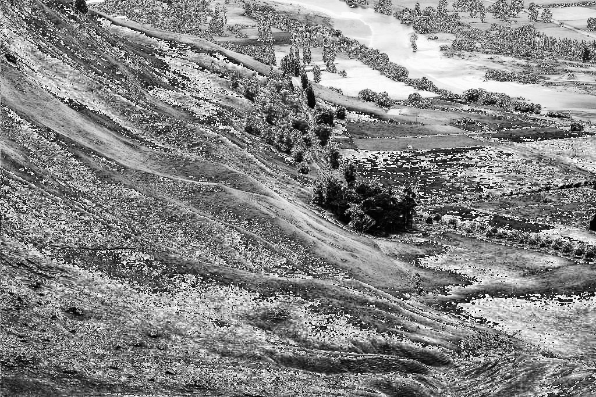
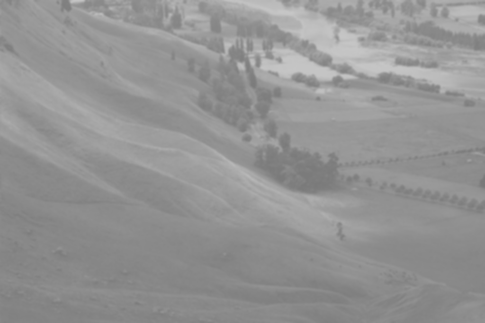

# Image Transformation

This project implements various methods of image transformation, focusing on mapping an original image to a transformed version by applying specific functions (kernels) to enhance image quality. The primary objectives include tasks such as noise reduction (e.g., White Noise Removal) and contrast enhancement (e.g., Histogram Equalization). This project serves as both an educational resource and a practical example, providing foundational insights into the basics of image processing for those interested in the field.

## Table of Contents

- [Installation](#installation)
- [Usage](#usage)

## Installation

1. Clone the repository:

    ```bash
    git clone "https://github.com/adelmomo/Image Processing and Computer Vision Techniques"
    ```

2. Navigate to the project directory:

    ```bash
    cd "Image Processing and Computer Vision Techniques/Image Transformation"
    ```

3. Install dependencies:

    ```bash
    pip install -r requirements.txt
    ```

## Input and Output

Here is an example of the input image and the resulting image outputs after performing the following Image Transformations:

### Input Image:


### Image Output After Histogram Equalization:


### Input Image:


### Image Output After Gaussian Blurring:


## Usage

To run the procedure on a sample image, use the following command:

1) Histogram Equalization

```bash
python main.py -i sample.jpg -o histogram_equalization_output.jpg histogram
```
2) Gaussian Blurring

```bash
python main.py -i sample.jpg -std 2 -ksize 7 -o gaussian_blur_output.jpg  gaussian