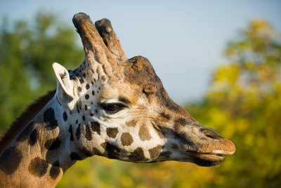

# Image Segmentation

This project demonstrates image segmentation using the K-Means algorithm to segment an image into k clusters. The primary goal is to illustrate the concept of image segmentation on a sample image.

## Table of Contents

- [Installation](#installation)
- [Usage](#usage)

## Installation

1. Clone the repository:

    ```bash
    git clone "https://github.com/adelmomo/Image-Processing-and-Computer-Vision-Techniques"
    ```

2. Navigate to the project directory:

    ```bash
    cd "Image-Processing-and-Computer-Vision-Techniques/ImageSegmentation"
    ```

3. Install dependencies:

    ```bash
    pip install -r requirements.txt
    ```

## Input and Output

Here is an example of the input image and the resulting segmented image output:

### Input Image:


### Segmented Image Output:


## Usage

To run the image segmentation algorithm on a sample image, use the following command:

```bash
python main.py -i ./sample.jpg -o output.jpg