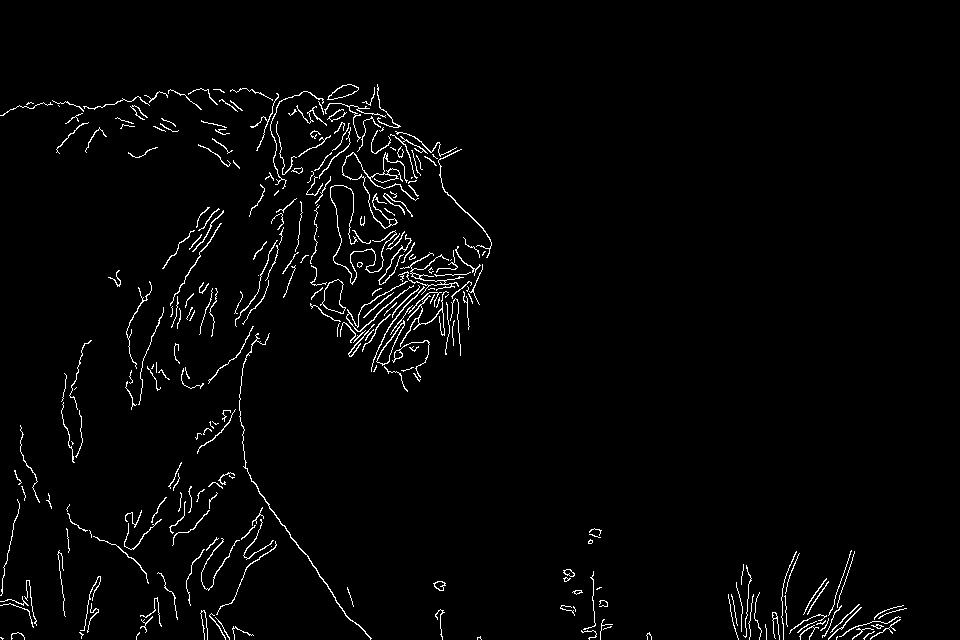

# Image Processing and Computer Vision Techniques
This repository is intended to demonstrate and implement the fundamental topics in Image Processing and Computer Vision

## Features

- **ImageTransformation**: Tools and algorithms for altering and enhancing images through various transformation techniques.

  

    
<strong>Input Image</strong>

    
  

  

    
<strong>Image Output After Histogram Equalization</strong>

    
  

  

    
<strong>Image Output After Gaussian Blurring</strong>

    
  

  

    
<strong>Input Image with Salt & Pepper Noise</strong>

    
  

  

    
<strong>Image Output After Median Filtering</strong>

    
  

- **EdgeDetection**: Implementations of edge detection algorithms to identify and outline features within images.

  

    
<strong>Input Image</strong>

    
  

  

    
<strong>Image Edges</strong>

    
  

## Edge Detection Application Demo

This is an application that strongly relies on Edge Detection to detect whether the Camera is covered or not. Here is a demo video showcasing the output after running the application:

https://github.com/user-attachments/assets/79bcd89e-ce39-4dee-9a63-e590748f968d

## Sub-Repositories

### Image Transformation

This sub-repository focuses on various image transformation techniques, including resizing, rotation, and color adjustments. It provides tools to modify images efficiently and effectively, offering a range of utilities to meet diverse transformation needs.

### Edge Detection

Dedicated to edge detection methods, this sub-repository includes algorithms for identifying boundaries and contours within images. It supports a variety of edge detection techniques, such as Sobel, Canny, and Laplacian, to assist in feature extraction and object recognition tasks.

## Usage

To get started with the tools and techniques provided in this repository, follow the instructions in each sub-repository's README files. Comprehensive guides and examples are included to help you integrate and utilize these tools in your own projects.
